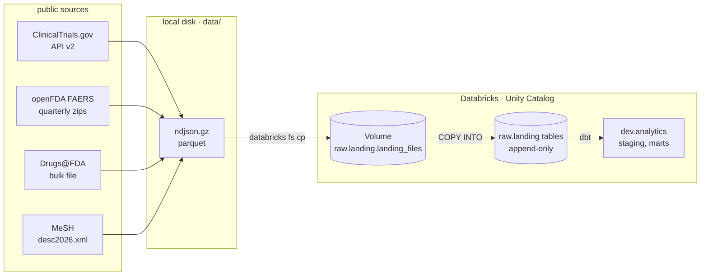
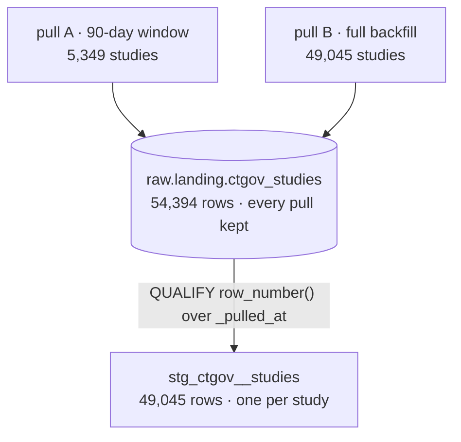

# drug-safety-warehouse

An analytics warehouse over public drug-safety data: which cancer drugs are in
trials, which are approved, and what adverse events get reported against them.
Python loaders for ingestion, dbt on Databricks (Unity Catalog) for modelling,
Airflow for orchestration.

## Sources

| source | what it is | grain | rows landed |
|---|---|---|---:|
| ClinicalTrials.gov API v2 | interventional oncology trials, phase 2/3 | one study per `nctId` | 54,394 |
| openFDA FAERS | adverse-event case reports, 4 quarters x 3 part-files | one report per `safetyreportid` | 144,000 |
| Drugs@FDA | approved applications, sponsors, products, ingredients | one application per `application_number` | 29,267 |
| MeSH 2026 | descriptor vocabulary with tree numbers | one descriptor per `descriptor_ui` | 31,110 |

258,771 rows total. Counts, natural keys and the double-load idempotency
[`docs/raw_counts.md`](docs/raw_counts.md). Warehouse capability probes —
recursive CTEs, materialized views, Volumes, Python models on serverless
are recorded in [`docs/verification.md`](docs/verification.md).

## Pipeline



Every step is idempotent. The loaders skip output files that already exist, and
`COPY INTO` skips files it has already ingested, so re-running any target
safe and inserts nothing new.

## Running it

```sh
uv sync                                    # install the pinned toolchain
source .env                                # DATABRICKS_HOST, DATABRICKS_HTTP_PATH, token

make load-all                              # all four sources, end to end
make load-ctgov ARGS="--since 2026-01-01"  # loader flags go through ARGS
make raw-counts                            # reproduce the row-count table
```

Each `make load-<source>` runs the same three steps for one source: pull to
`data/`, upload to the UC Volume, `COPY INTO raw.landing`. The loaders read
`.env` themselves; `source .env` is what puts the same values in dbt's
environment.

## Design decisions

### The raw layer is append-only, not upserted

`raw.landing` is a log of what each pull returned. Rows are only ever add
never updated, merged or deduplicated at load time. Every row carries
`_loaded_at`, `_source_file` and `_batch_id`. Current state is **derived**
downstream in staging, not stored here.

The rejected alternative was upsert: merge each pull into a table holding one
row per key, so raw mirrors the source as of now. It produces a tidier table —
and destroys history irreversibly. Overwrite a study's row and its previous
version is gone from the system for good. A log can always be collapsed i
current state; current state can never be expanded back into a log.



**The cost, stated plainly.** Two things are being paid for that:

1. **Storage.** `ctgov_studies` holds 54,394 rows for 49,045 studies — 5,349
   rows of pure duplication today, growing with every pull. openFDA repub
   quarters as late reports arrive, and the part count is embedded in each
   filename (`0001-of-0036`), so a republished quarter lands under new names as
   new files and both vintages persist.
2. **A permanent dedup obligation on every consumer.** Each staging model must
   resolve latest-state itself, and one that forgets over-counts silently. The
   obligation has sharp edges: FAERS `safetyreportversion` is a *string*,
   dedup that orders by it without casting to int sorts `'9' > '103'` and keeps
   the oldest revision while looking correct.

Both are accepted deliberately. Reprocessability and auditability are the
of a raw layer; a raw layer you cannot replay is just a slow copy of the source.
