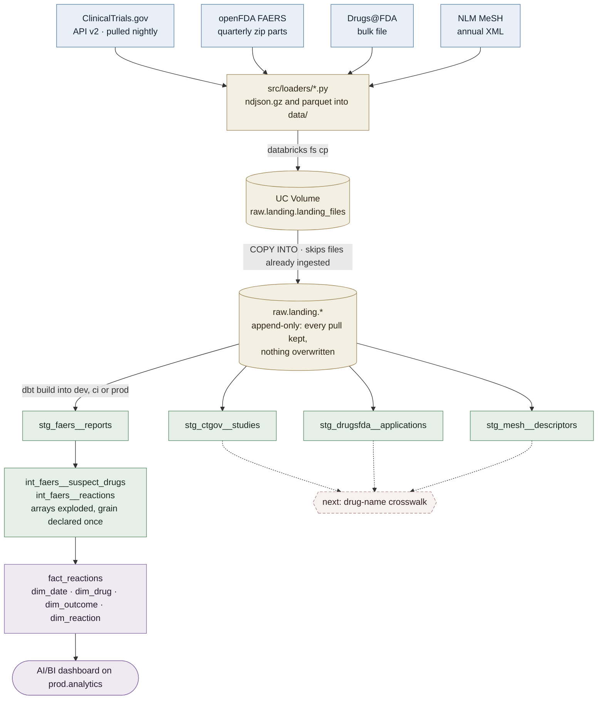

# drug-safety-warehouse

Tested dbt warehouse on Databricks over FDA adverse-event, trial and approval data, with CI/CD and a live dashboard

[](https://github.com/fahad4058/drug-safety-warehouse/actions/workflows/pr.yml)
[](https://github.com/fahad4058/drug-safety-warehouse/actions/workflows/deploy.yml)
[](https://github.com/fahad4058/drug-safety-warehouse/actions/workflows/nightly.yml)

[](docs/adverse_event_outcomes.pdf)

Four public drug-safety sources — ClinicalTrials.gov, openFDA FAERS, Drugs@FDA
and the NLM MeSH vocabulary — landed append-only into Unity Catalog, staged and
tested in dbt with per-source freshness thresholds, and built into `dev`, `ci`
and `prod` catalogs by GitHub Actions. **FAERS is carried the whole way**:
arrays exploded in an intermediate layer, then a Kimball star and a native
Databricks dashboard over one complete year of case reports. The other three
stop at staging on purpose — joining them needs a drug-name crosswalk, which is
the next piece of work. Every design decision is written up with the number
that justified it.

## Table of Contents

- [Background](#background)
- [The product](#the-product)
- [Architecture](#architecture)
- [Stack](#stack)
- [Install](#install)
- [Usage](#usage)
- [Data model](#data-model)
- [Design decisions](#design-decisions)
- [Development and CI/CD](#development-and-cicd)
- [Roadmap](#roadmap)
- [Maintainer](#maintainer)
- [Contributing](#contributing)
- [Data and disclaimer](#data-and-disclaimer)
- [License](#license)

## Background

### Problem statement

Public drug-safety data is analytically hostile in exactly the ways that make
it a good analytics-engineering problem. The question the warehouse exists to
answer — *which drugs are accumulating adverse-event reports, and what does the
trial and approval pipeline around them look like?* — cannot be answered by
counting rows. Each source breaks a naive count in its own way:

| problem in the data | how this repo handles it |
|---|---|
| **FAERS case versioning inflates counts.** One case produces several report versions; count them all and every number is wrong by the amendment rate. | Staging keeps the newest version per `safetyreportid`, ordered by an integer-cast version so `'9'` never beats `'103'`, so a republished quarter's revision replaces the original instead of double-counting. |
| **The grain explodes on contact.** Every report carries arrays of drugs and arrays of reactions. "Events per drug" is meaningless until a grain is declared. | Staging never explodes an array; the intermediate layer does, once. The fact is declared at one reaction within one report, and death metrics count reports, not rows. |
| **Drug names are chaos.** Brands, generics, salt forms, dosage forms, typos. openFDA harmonizes only some of them. | The harmonized generic name where it exists — the shortest of its spelling variants — and the product name as reported otherwise, with `drug_name_source` recording which path each name took. |
| **ClinicalTrials.gov overwrites itself.** A trial's status flips and the history is gone at the source. | The raw layer is an append-only log and a nightly pull keeps every version, so the history the source discards accumulates here instead. |
| **Dates are dirty and reports arrive late.** A large share of trial dates carry only month precision; FDA receipt lags onset by years. | Parsed with a precision flag per date rather than silently nulled, so the invented day stays recoverable; late re-transmission is documented on the dashboard rather than hidden. |
| **Conditions only mean something through a hierarchy.** MeSH descriptors sit in several tree positions at once — a DAG, not a tree. | Tree numbers are carried whole in staging, so deduplication always precedes fan-out and a descriptor removed by a later MeSH edition cannot come back to life. |

### Sources

| source | what it is | grain | publishing cadence | freshness warn / error | modelled to |
|---|---|---|---|---|---|
| ClinicalTrials.gov API v2 | interventional oncology trials, phase 2/3 | one study per `nctId` | continuous; pulled nightly | 12h / 24h | staging |
| openFDA FAERS | adverse-event case reports, four complete quarters (Q3 2025 – Q2 2026) | one report per `safetyreportid` | quarterly, with late republication | 45d / 120d | **star** |
| Drugs@FDA | approved applications, sponsors, products, ingredients | one application per `application_number` | bulk file, refreshed weekly | 14d / 30d | staging |
| MeSH | descriptor vocabulary with tree numbers | one descriptor per `descriptor_ui` | annual | opted out | staging |

Row counts are deliberately not listed here — they change with every pull.
The `analyses/` directory recomputes them from the warehouse:
[`profile_faers`](analyses/profile_faers.sql),
[`profile_mesh`](analyses/profile_mesh.sql),
[`profile_drugsfda`](analyses/profile_drugsfda.sql) and
[`staging_row_reconciliation`](analyses/staging_row_reconciliation.sql).
Run any of them with `dbt show -s <name> --limit -1`. Warehouse capability
probes are in [`docs/verification.md`](docs/verification.md).

## The product

An adverse-event outcomes dashboard over one complete year of FDA case
reports, served natively in Databricks on a Kimball star in the `prod`
catalog. Every merge to `main` redeploys prod; a nightly job pulls new trial
registrations, checks source freshness and rebuilds it. The live dashboard
requires registration in the Databricks account — the free tier has no public
links — so the image at the top of this page is the export; clicking it opens
[the full-fidelity PDF](docs/adverse_event_outcomes.pdf).

Measured 2026-08-27 with `dbt show -s profile_faers --limit -1 --target prod`,
four complete FAERS quarters (Q3 2025 – Q2 2026):
1,533,685 raw rows collapse to **1,436,423 cases** and **4,638,022 reaction
events** across 5,040 drugs and 16,849 reaction terms. With the FDA's
probable-duplicate flag excluded, the dashboard shows 1.17M cases, 3.55M
reactions and 79k cases with a fatal outcome. The caveats in its header are
part of the product: reporting rates are not risk rates, deaths are counted
per case rather than per symptom, and the duplicate flag (~19% of cases) is
excluded by default.

## Architecture



Solid arrows are what is built; the dotted ones are what the crosswalk will
connect. Staging is where all four sources land and stop — only FAERS carries
through to the star today.

Every step is idempotent: the loaders skip output files that already exist,
`COPY INTO` skips files it has already ingested, and dbt rebuilds are
deterministic, so re-running any target is safe. That claim is not assumed —
[`docs/raw_layer.md`](docs/raw_layer.md) records the double-load experiment
that establishes it, alongside how rows land and what each stamped column is
for.

## Stack

| layer | tool | pinned |
|---|---|---|
| warehouse | Databricks Free Edition — serverless SQL warehouse (2X-Small), Unity Catalog, Volumes, Delta Lake, `COPY INTO` | — |
| transformation | dbt Core + dbt-databricks | 1.11.8 (`~=1.11.0`) |
| ingestion | Python — `httpx`, `ijson` (streaming JSON), `pyarrow`; Databricks CLI; `make` | Python 3.12 |
| environment | uv, lockfile-installed everywhere | `>=0.12.5,<0.13` via `required-version` |
| quality gate | sqlfluff (databricks dialect), pre-commit | 4.3.0 |
| CI/CD | GitHub Actions — required PR check, deploy on merge, nightly cron | — |
| consumption | Databricks AI/BI dashboard | — |

## Install

### Requirements

- [uv](https://docs.astral.sh/uv/) 0.12.x, [Databricks CLI](https://docs.databricks.com/dev-tools/cli/), `make`
- A Databricks workspace with a SQL warehouse and Unity Catalog. Free Edition
  is enough; the catalogs `raw`, `dev`, `ci`, `prod` and the Volume are created
  by `scripts/bootstrap_workspace.sql`.
- Disk for the data you pull: the sampled FAERS load is ~2 GB, four complete
  quarters ~12 GB.

### Steps

```sh
git clone https://github.com/fahad4058/drug-safety-warehouse.git
cd drug-safety-warehouse
uv sync                                   # installs the pinned toolchain from uv.lock
cp .env.example .env                      # fill in the four values below
source .env
uv run dbt debug                          # confirms the connection
pre-commit install                        # lint on commit, and block commits to main
```

`.env` holds `DATABRICKS_HOST`, `DATABRICKS_HTTP_PATH` and the access token
under two names — `DBT_ENV_SECRET_DATABRICKS_TOKEN` for dbt, which scrubs
anything with that prefix from its logs, and `DATABRICKS_TOKEN` for the
Databricks CLI. `profiles.yml` reads only the first three, so the same file
serves the laptop and CI.

## Usage

```sh
make load-all                              # all four sources; FAERS defaults to a 3-part sample per quarter
make load-faers ARGS="--parts 40"          # every part of the two newest quarters (~3 GB each)
make load-ctgov ARGS="--since 2026-01-01"  # loader flags go through ARGS
uv run dbt show -s staging_row_reconciliation --limit -1   # landed vs staged, per source

uv run dbt build                           # models, seeds and every test
uv run dbt source freshness                # writes target/sources.json; non-zero exit on error
```

Each `make load-<source>` runs the same three steps for one source: pull to
`data/`, upload to the Unity Catalog Volume, `COPY INTO raw.landing`. A build
ends with the line worth reading — the node count is the signal that every
test was found and run:

```text
Found 11 models, 4 analyses, 54 data tests, 1 seed, 4 sources, 733 macros
...
Done. PASS=66 WARN=0 ERROR=0 SKIP=0 NO-OP=0 TOTAL=66
```

Use `uv run dbt`, never bare `dbt` — the pinned dbt-core lives in the project's
virtual environment, and a globally installed dbt is a different program.

### Layout

```text
src/loaders/          one Python puller per source, writing to data/
scripts/              raw SQL sent straight to the warehouse: bootstrap,
                      COPY INTO, one-time capability probes
models/staging/       one folder per source — source declarations, staging
                      models, and their tests
models/intermediate/  the fan-out staging defers: arrays exploded, one
                      suspect drug resolved per report
models/marts/         the star: fact_reactions plus four dimensions
macros/               surrogate_key()
seeds/                reference data whose source of truth is this repo
analyses/             profiling and reconciliation SQL: compiled with ref()
                      resolved, run on demand, never part of a build
docs/                 dated measurements, capability probes, dashboard export
.github/workflows/    pr (required check), deploy (CD on merge), nightly
                      refresh (cron: pull, freshness, rebuild)
Makefile              the landing pipeline, one target per source
```

Three directories hold `.sql` files and they are not interchangeable:
`scripts/` is raw SQL with no dbt involvement — `{{ ref() }}` in there reaches
the warehouse verbatim and fails; `models/` builds objects in the warehouse on
every run; `analyses/` is never built by `dbt run`, but `dbt show -s <name>`
compiles and executes one on demand, which is where every measured number in
this repo comes from.

## Data model

```text
                    dim_date                          dim_outcome
                    date_key  (yyyymmdd)              outcome_key
                    year, quarter, month, weekday     E2B code, label, 'Not stated'
                           \                              /
                            \                            /
   dim_drug ----------- fact_reactions ------------------ dim_reaction
   drug_key             GRAIN  one reaction in one        reaction_key
   drug_name                   case report                reaction_term (MedDRA)
   name source          FK     date, drug, outcome, reaction
   reports              DD     safety_report_id
                        flags  is_serious, is_report_death,
                               is_probable_duplicate, n_suspect_drugs
```

`raw.landing` is an append-only log. Staging turns it into current state: one
row per source entity, casts applied, columns renamed to snake_case.

**Staging may correct grain. It may never create grain.** Collapsing several
pulls of the same study back to one row is correction, and belongs here.
Exploding a trial's arm groups into one row per arm is creation, and does not —
that is intermediate-layer work. Every array is carried through whole:
`armGroups`, `interventions`, `conditions`, `patient.drug`, `patient.reaction`,
`products`, `submissions`, `openfda`, `tree_numbers`. The consequence is that
deduplication always happens before any fan-out, which is the correct order: a
tree number that a later MeSH edition removed cannot come back to life.

Three of the four staging models keep the latest row per key. `drugsfda` is
different: it is scoped to the newest `_batch_id` first, because the source
re-publishes its entire catalogue on every pull, so the newest batch is a
mirror and a key missing from it means the application was withdrawn. Applying
that scoping to ClinicalTrials.gov would be wrong — its newest batch is a
seven-day delta, not a mirror. Same config, opposite answers, decided by what
the loader actually fetches.

The marts layer is a Kimball star. Dimensions are joined by md5 surrogate keys
rebuilt identically on both sides, so fact and dimension agree by
construction. Null keys never reach the fact — missing outcomes and drugs
route to explicit default rows, so the relationship tests cover every row.
Two documented attributions keep the model honest. A report's drug is its
first-listed suspect, though many reports name more than one. A drug's name is
openFDA's harmonized generic name where one exists — the shortest of its
spelling variants, since multi-element name arrays are variants of one
ingredient, not combination products — and otherwise the product name as the
reporter wrote it, so a brand and its generic can appear as separate rows
until the Drugs@FDA crosswalk lands.
Death metrics count distinct reports, never reaction rows: a fatal report
marks all its reactions, so counting rows overstates deaths severalfold.

## Design decisions

### The raw layer is append-only, not upserted

```text
  pull A   90-day window   --+
  pull B   full backfill   --+-->  raw.landing.ctgov_studies   --QUALIFY row_number()-->  stg_ctgov__studies
  pull C.. daily deltas    --+     every pull kept                over _pulled_at desc      one row per study
```

Rows are only ever added, never updated, merged or deduplicated at load time.
Every row carries `_loaded_at`, `_source_file` and `_batch_id`; current state
is **derived** in staging, not stored in raw. The rejected alternative was
upsert — a tidier table that destroys history irreversibly. A log can always
be collapsed into current state; current state can never be expanded back
into a log.

**The cost, stated plainly.** Storage: the same entity lands again on every
pull that touches it, and both ClinicalTrials.gov and FAERS carry a
double-digit share of repeat rows —
[`analyses/staging_row_reconciliation.sql`](analyses/staging_row_reconciliation.sql)
prints `landed_rows`, `distinct_keys` and `rows_removed` per source, which is
where that share is read rather than remembered. And a permanent
deduplication obligation on every consumer: a staging model that forgets
over-counts silently, and the edges are sharp — FAERS `safetyreportversion`
is a *string*, so an uncast `order by` sorts `'9' > '103'` and keeps the
oldest revision while looking correct. Both costs are accepted: a raw layer
you cannot replay is just a slow copy of the source.

### Freshness thresholds follow publishing cadence, not a single rule

One threshold for every source does not survive contact with `COPY INTO`,
which skips files it has already ingested: a faultless daily run inserts
nothing and leaves `max(_loaded_at)` exactly where it was. Under a flat
26h/50h rule, FAERS and Drugs@FDA would go red within days and stay red no
matter how well the pipeline ran. So freshness here measures **data
recency**, not pipeline liveness, and each threshold matches how often that
source actually publishes. MeSH, published once a year, opts out with an
explicit `freshness: null` — which *excludes* it from `dbt source freshness`
rather than passing it.

The nightly workflow runs the check after the load and writes the result into
the run summary rather than failing on it. A source going stale is news about
the publisher, not a broken pipeline: Drugs@FDA goes amber whenever openFDA is
slow to republish, and gating on that would leave a red badge over a pipeline
that is working. The check also has to run *after* the pull, because
ClinicalTrials.gov's 24h error threshold and the cron's 24h period are the same
number — measured before, a healthy run reports red every night.

### `unique` belongs on staging models, not on sources

An append-only raw table holds duplicate natural keys by construction, so
`unique` at source level would be false by design on ClinicalTrials.gov, and
the other three would pass today and fail later — on the first revised FAERS
case, the first Drugs@FDA re-pull, the next MeSH edition. A test that passes
only because the system has not been exercised reads as coverage while
asserting nothing. Sources carry `not_null` on natural keys and load metadata;
`unique` sits on staging, where it verifies that deduplication actually
worked — and on FAERS it now collapses real duplicate rows rather than none.

### CI builds for real, not `--empty`

`dbt build --empty` resolves every `ref()` and `source()` to zero rows, and
data tests use the same resolver — every test would pass against nothing. The
full build runs in under four minutes on 1.4M cases, so CI runs it against a
dedicated `ci` catalog. The cost is that CI depends on the warehouse being
reachable.

## Development and CI/CD

```text
  feature branch --push--> pull request --> [pr]      sqlfluff lint + dbt build --target ci
                                                |     required status check, binds admins too
                                                v  green
                                          merge to main --> [deploy]   dbt build --target prod

  cron 00:30 UTC ----------------------------------------> [nightly refresh]  load ctgov + source freshness + dbt build --target prod
```

`deploy` and `nightly refresh` run the same `dbt build --target prod` for
different reasons — one because the code changed, one because the data did —
so they share a concurrency group; two builds of the same catalog would clobber
each other. The asymmetry is deliberate: a merge queues behind a running pull
and never cancels it, because a superseded deploy costs nothing while a
cancelled pull loses that day's ClinicalTrials.gov window for good.

```sh
uv run sqlfluff lint models analyses          # databricks dialect, jinja templater
uv run dbt build                              # models, seeds, and every test
uv run dbt show -s profile_faers --limit -1   # the numbers behind the prose
```

CI always parses from scratch, so its test count is authoritative when it
disagrees with a local run. The toolchain is pinned end to end: packages by
`uv.lock`, `uv` itself by `required-version` in `pyproject.toml`, which the
workflows read. Lint rule exclusions are in `.sqlfluff`, each with the reason
it was excluded. Every pull request carries four headings — what changed,
why, the measured number, the tradeoff — and those descriptions are where the
design-decision notes above come from.

## Roadmap

- **Snapshots over the staging views**, so ClinicalTrials.gov dimensions gain
  history instead of being overwritten. The nightly pulls have been
  accumulating genuine change since August 2026 for exactly this.
- **Entity resolution across drug names** — the crosswalk that connects
  Drugs@FDA and MeSH to the FAERS star, plus a multivalued bridge for reports
  naming several suspect drugs. The blocking measurement is already done:
  openFDA's harmonization block is null on a majority of Drugs@FDA
  applications ([`analyses/profile_drugsfda.sql`](analyses/profile_drugsfda.sql)),
  so normalized-name matching has to be the primary path, not the fallback.

## Maintainer

Fahad Maqsood — [@fahad4058](https://github.com/fahad4058)


## Contributing

Questions and suggestions are welcome as GitHub issues. Pull requests are
accepted: they must pass `sqlfluff lint` and the `lint and build` check, and
use the four-heading template in `.github/pull_request_template.md`.

## Data and disclaimer

Sources: [openFDA](https://open.fda.gov/) (FAERS, Drugs@FDA),
[ClinicalTrials.gov](https://clinicaltrials.gov/), and the
[NLM Medical Subject Headings](https://www.nlm.nih.gov/mesh/). This is an
engineering portfolio, not pharmacovigilance inference: FAERS records what
was *reported*, voluntarily and unevenly; disproportionate report counts are
not causal safety signals, nothing here measures the risk of any drug, and
nothing here is medical advice.

## License

[MIT](LICENSE) © 2026 Fahad Maqsood
