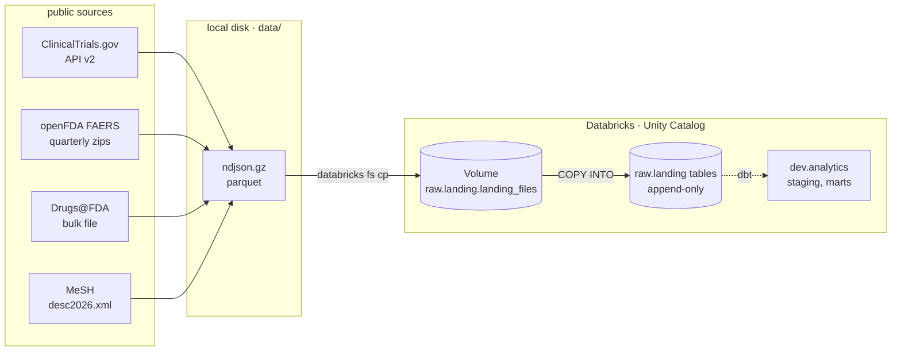
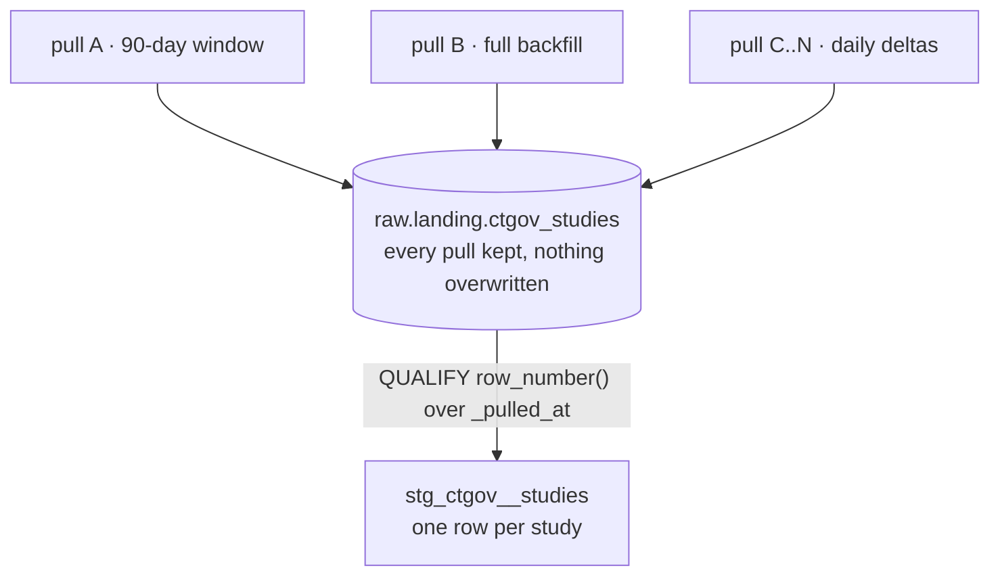

# drug-safety-warehouse

[](https://github.com/fahad4058/drug-safety-warehouse/actions/workflows/pr.yml)

An analytics warehouse over public drug-safety data: which cancer drugs are in
trials, which are approved, and what adverse events get reported against them.
Python loaders for ingestion, dbt on Databricks (Unity Catalog) for modelling,
Airflow for orchestration.

## Layout

```
src/loaders/         one Python puller per source, writing to data/
scripts/             raw SQL sent straight to the warehouse: bootstrap,
                     COPY INTO, and rerunnable profiling probes
models/staging/      one folder per source — source declarations, staging
                     models, and their tests
seeds/               reference data whose source of truth is this repo
analyses/            SQL that dbt compiles but never runs
docs/                dated measurements and warehouse capability probes
.github/workflows/   the checks that run on every pull request
Makefile             the landing pipeline, one target per source
```

Three directories hold `.sql` files and they are not interchangeable.
`scripts/` is raw SQL with no dbt involvement — `{{ ref() }}` in there reaches
the warehouse verbatim and fails. `models/` builds objects in the warehouse.
`analyses/` is compiled and handed back to you, never executed.

## Pipeline



Every step is idempotent. The loaders skip output files that already exist, and
`COPY INTO` skips files it has already ingested, so re-running any target is
safe and inserts nothing new.

## Getting started

Requires [uv](https://docs.astral.sh/uv/), the
[Databricks CLI](https://docs.databricks.com/dev-tools/cli/), and a Databricks
workspace with a SQL warehouse. Copy `.env` with `DATABRICKS_HOST`,
`DATABRICKS_HTTP_PATH` and `DBT_ENV_SECRET_DATABRICKS_TOKEN`.

```sh
uv sync                                    # install the pinned toolchain
source .env                                # put the credentials in the environment

make load-all                              # all four sources, end to end
make load-ctgov ARGS="--since 2026-01-01"  # loader flags go through ARGS
make raw-counts                            # row counts straight from the warehouse

uv run dbt build                           # models, seeds and tests
```

Each `make load-<source>` runs the same three steps for one source: pull to
`data/`, upload to the Unity Catalog Volume, `COPY INTO raw.landing`. The
loaders read `.env` themselves; `source .env` is what puts the same values into
dbt's environment.

Use `uv run dbt`, never bare `dbt` — the pinned dbt-core lives in the project's
virtual environment, and a globally installed dbt is a different program.

## Sources

| source | what it is | grain | publishing cadence | freshness warn / error |
|---|---|---|---|---|
| ClinicalTrials.gov API v2 | interventional oncology trials, phase 2/3 | one study per `nctId` | continuous; pulled daily | 12h / 24h |
| openFDA FAERS | adverse-event case reports | one report per `safetyreportid` | quarterly, with late republication | 45d / 120d |
| Drugs@FDA | approved applications, sponsors, products, ingredients | one application per `application_number` | bulk file, refreshed weekly | 14d / 30d |
| MeSH | descriptor vocabulary with tree numbers | one descriptor per `descriptor_ui` | annual | opted out |

Row counts are deliberately not listed here — they change with every pull.
`analyses/staging_row_reconciliation.sql` recomputes them from the warehouse:
rows landed, distinct entities behind them, and rows surviving staging, per
source. Dated readings and the double-load idempotency evidence are in
[`docs/raw_counts.md`](docs/raw_counts.md); warehouse capability probes —
recursive CTEs, materialized views, Volumes, Python models on serverless — are
in [`docs/verification.md`](docs/verification.md).

## Modelling

`raw.landing` is an append-only log. Staging turns it into current state: one
row per source entity, casts applied, columns renamed to snake_case.

**Staging may correct grain. It may never create grain.** Collapsing several
pulls of the same study back to one row is correction, and belongs here.
Exploding a trial's arm groups into one row per arm is creation, and does not —
that is intermediate-layer work. Every array is carried through whole:
`armGroups`, `interventions`, `conditions`, `patient.drug`, `patient.reaction`,
`products`, `submissions`, `openfda`, `tree_numbers`. The consequence is that
deduplication always happens before any fan-out, which is the correct order: a
tree number that a later MeSH edition removed cannot come back to life.

Three of the four staging models keep the latest row per key. `drugsfda` is
different: it is scoped to the newest `_batch_id` first, because the source
re-publishes its entire catalogue on every pull, so the newest batch is a
mirror and a key missing from it means the application was withdrawn. Applying
that scoping to ClinicalTrials.gov would be wrong — its newest batch is a
seven-day delta, not a mirror. Same config, opposite answers, decided by what
the loader actually fetches.

## Design decisions

### The raw layer is append-only, not upserted

`raw.landing` is a log of what each pull returned. Rows are only ever added,
never updated, merged or deduplicated at load time. Every row carries
`_loaded_at`, `_source_file` and `_batch_id`. Current state is **derived**
downstream in staging, not stored here.

The rejected alternative was upsert: merge each pull into a table holding one
row per key, so that raw mirrors the source as of now. It produces a tidier
table — and destroys history irreversibly. Overwrite a study's row and its
previous version is gone from the system for good. A log can always be
collapsed into current state; current state can never be expanded back into a
log.



**The cost, stated plainly.** Two things are being paid for that:

1. **Storage.** The same study lands again on every pull that touches it.
   Measured 2026-08-23: 55,991 rows behind 49,131 studies — 6,860 rows of pure
   duplication, 12.3% of the table, growing with every pull. openFDA
   republishes quarters as late reports arrive, and the part number is embedded
   in each filename (`0001-of-0036`), so a republished quarter lands under new
   names and both vintages persist.
2. **A permanent deduplication obligation on every consumer.** Each staging
   model must resolve latest-state itself, and one that forgets over-counts
   silently. The obligation has sharp edges: FAERS `safetyreportversion` is a
   *string*, so a dedup that orders by it without casting to int sorts
   `'9' > '103'` and keeps the oldest revision while looking correct.

Both are accepted deliberately. Reprocessability and auditability are the point
of a raw layer; a raw layer you cannot replay is just a slow copy of the source.

### Freshness thresholds follow publishing cadence, not a single rule

The obvious design is one threshold for every source. It does not survive
contact with `COPY INTO`, which skips files it has already ingested: a
faultless daily run inserts nothing and leaves `max(_loaded_at)` exactly where
it was. Under a flat 26h/50h rule, FAERS and Drugs@FDA would go red within days
and stay red no matter how well the pipeline ran.

So freshness here measures **data recency**, not pipeline liveness, and each
threshold matches how often that source actually publishes (see the table
above). MeSH, published once a year, opts out entirely with an explicit
`freshness: null`.

### `unique` belongs on staging models, not on sources

The append-only design means a raw table holds duplicate natural keys by
construction, so `unique` at source level would be false by design on
ClinicalTrials.gov. The other three would pass today and fail later — on the
first revised FAERS case, the first Drugs@FDA re-pull, the next MeSH edition.
A test that passes only because the system has not yet been exercised reads as
coverage while asserting nothing.

Sources therefore carry `not_null` on natural keys and load metadata only.
`unique` sits on the staging models, where it verifies that deduplication
actually worked.

ClinicalTrials.gov. The other three would pass today and fail later — on the
first revised FAERS case, the first Drugs@FDA re-pull, the next MeSH edition.
A test that passes only because the system has not yet been exercised reads as
coverage while asserting nothing.

Sources therefore carry `not_null` on natural keys and load metadata only.
`unique` sits on the staging models, where it verifies that deduplication
actually worked.

## Development

```sh
uv run sqlfluff lint models analyses   # databricks dialect, jinja templater
uv run dbt build                       # models, seeds, and every test
uv run dbt source freshness            # writes target/sources.json; non-zero on error
pre-commit install                     # lint on commit, and block commits to main
```

Every pull request runs `sqlfluff lint`, `dbt deps` and `dbt build --target ci`
on a clean machine, installing from `uv.lock`. That check is required before
`main` will accept a merge, and it applies to administrators too. CI builds
into a separate `ci` catalog and always parses from scratch, so its test count
is authoritative when it disagrees with a local run.

Lint rule exclusions are in `.sqlfluff`, each with the reason it was excluded.
